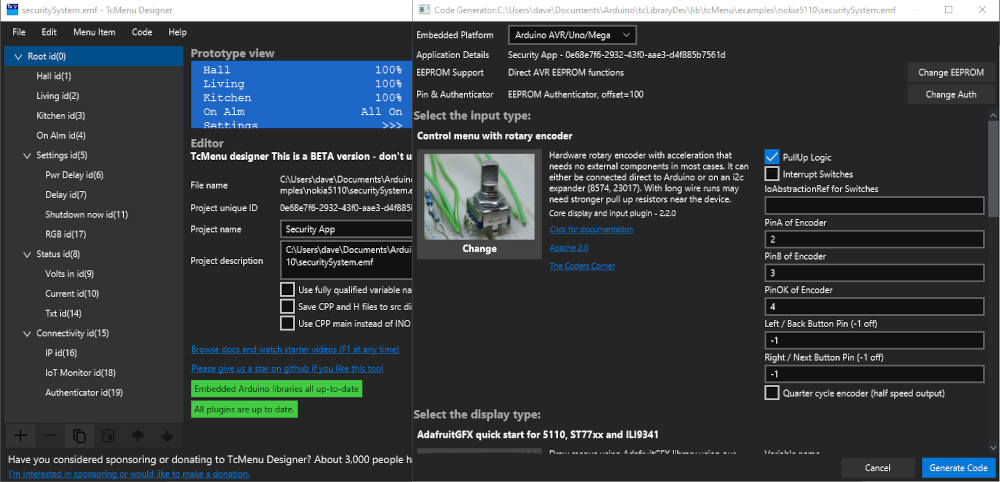

## tcMenu - A menu library and designer for Arduino and mbed with IoT capabilities

A menu library and designer UI for Arduino and mbed that is modular enough to support different input methods, display modules and IoT / remote control methods. TcMenu is more than just an Arduino menu library, think of it as a framework for building IoT applications that includes the ability to render menus locally onto a display.

Initially, you can use the menu designer UI that is packaged with every release, and available for Windows, macOS, and Linux. The designer UI takes care of building the core menu code and putting any callback functions into your sketch file. Think of the designer like a form designer in the desktop domain. Furthermore, It's non destructive on the sketch file, so can be round tripped during development. 

TheCodersCorner.com invest a lot of time and resources into making this open source product which is used by literally thousands of users. We don't presently sell hardware or have any other income streams from it, we ask that especially commercial users consider making a voluntary contribution to help keep us going using the sponsor button. 

In any fork, please ensure all text up to here is left unaltered.

## Documentation

[UI user guide, getting started and other documentation](https://www.thecoderscorner.com/products/arduino-libraries/tc-menu/)

[Full API embedded documentation](https://www.thecoderscorner.com/ref-docs/tcmenu/html/index.html)

## Questions, community forum and support

There is a forum where questions can be asked, but the rules of engagement are: **this is my hobby, I make it available because it helps others**. Don't expect immediate answers, make sure you've recreated the problem in a simple sketch that you can send to me. Please consider making at least a one time donation using the sponsor link above before using the forum.

* [TCC Libraries community discussion forum](https://www.thecoderscorner.com/jforum/)
* [Consultancy pages on the coders corner](https://www.thecoderscorner.com/support-services/consultancy/)
* I also monitor the Arduino forum [https://forum.arduino.cc/], Arduino related questions can be asked there too.

## Packaged installation for Windows, Linux, and MacOS.

Releases are directly available from the releases page, there is a signed Windows version, notarized macOS version, and a package for Linux:

[Get the latest TcMenu Designer release](https://github.com/davetcc/tcMenu/releases)

Although most will use the above packages, it's also possible to build from source, full instructions are in the tcMenuGenerator folder. We ask that you only build from source for your own use.

Here's a couple of screen-shots of the designer UI - runs on Windows, macOS and Linux:

and embedCONTROL desktop that can control menu based apps - runs on Windows, macOS and Linux:

## Generating a menu from the UI for the impatient

If you don't want to read the above documentation this gives a very quick start. Open the tcMenu Designer UI and set up your Arduino directory in "Edit -> General Settings", then check the "Library Versions" tab to ensure the embedded libraries are installed / up to date.

Once the tcMenu library directory is located, the "File -> Examples" menu will load with all the examples. Load the example closest to the hardware you have. Once it's open, you'll see the menu tree structure on the left, and the details for each menu when selected on the right. Below the menu tree are buttons that manage items in the menu tree. 

Once you've arranged your menu using the UI how you'd like it, choose `Code -> ID & Eeprom analyser` from the menu to check that you've not got any overlapping ranges, then choose `Code -> Generate` from the menu, choose appropriate hardware arrangements and hit generate.

The Generator is capable of round trip development too - most of the code is offloaded into associated CPP and Header files.

## TcMenu still supports Uno with LiquidCrystal dfRobot shield or Ssd1306Ascii

We try to keep Uno viable for tcMenu. However, there are limitations to what we can do. You can run a full menu on an Uno, but it's unlikely that the remote Ethernet support will fit. For anything that includes remote control support, we recommend at least 64K of flash memory. We store the menu items in static RAM where it's supported by the hardware, to further reduce memory on the board.

## Libraries required for tcMenu

TcMenu supports different boards and build tools. It is possible to use it directly with both platformIO and Arduino IDE. It should also work with most mbed tooling as the libraries compile on mbed.

**The easiest way to get started is to install tcMenu library using library manager**, all the dependencies are automatically installed. However, if you like to manually manage libraries, below are the links to their repos:

### Embedded Libraries for Arduino and mbed 

* tcMenuLib - https://github.com/davetcc/tcMenuLib
* IoAbstraction - https://github.com/davetcc/IoAbstraction
* TaskManagerIO - https://github.com/davetcc/TaskManagerIO
* SimpleCollections - https://github.com/davetcc/SimpleCollections

### Additional libraries you may need depending on display

* LiquidCrystalIO forked from Arduino version - https://github.com/davetcc/LiquidCrystalIO 
* Adafruit-GFX-mbed-fork - https://github.com/davetcc/Adafruit-GFX-mbed-fork
* TFT-eSPI by Bodmer - https://github.com/Bodmer/TFT_eSPI
* Adafruit_GFX by AdaFruit- https://github.com/adafruit/Adafruit-GFX-Library 
* U8G2 by olikraus - https://github.com/olikraus/u8g2

### Main Java source code locations

The designer UI code base and plugins for 2.0 onwards are located in this repository, the 1.7 plugins were here https://github.com/davetcc/tcMenuXmlPlugins. The designer, library and shipped plugins are all Apache licensed.

## Input and display technologies

Here are a few examples of how the menu can look with version 2.0 of our menu library on Arduino, ESP, and mbed:

### Support for rotary encoders, digital/analog joysticks and touch buttons

We fully support rotary encoder based input with no need for any additional components in many cases. You can even connect your rotary encoder on a PCF8574 or MCP23017. Further, we even support more than one encoder.

You can configure 3 or more buttons to work like a digital joystick using button based rotary encoder emulation (Up, Down and OK buttons with optional left and right) on either board pins, i2c expander, shift register. DfRobot analog input style buttons. Either DfRobot, or other analog ladder (configurable in code).

We also support the ESP32 touch pad interface, allowing up to 9 touch buttons to be used for menu input, they currently configure as per digital joystick.

### Support for matrix keyboards

Matrix Keyboards of configurable size and key combination. Pre-canned options for 4x3 and 4x4 layouts. Most of the core functions work with a matrix keyboard.

### Support for touch screens

From 2.0 onwards we'll support touch screen interfaces. We have built the support so that we can add many devices later, but to start with we will support resistive touch screens using 4 inputs, and the STM32 BSP provided touch screen interface.

### Drawing to LiquidCrystal (i2c or direct)

We have a fork LiquidCrystal for 20x4 or 16x2 displays - can be either directly connected, over an i2c sheild (PCF8574, MCP23017)  or on a shift register. Our version of the library integrates better with task manager, yielding frequently.

### Adafruit_GFX integration for many displays

Most libraries that are compatible with Adafruit_GFX will work with tcMenu, we've tested with the following TFT's ILI9341, ST7735 and also Nokia 5110 display. We even have a quick start option that helps you get started with this option.

For mbed RTOS 5/6 we have a custom Adafruit_GFX OLED driver https://github.com/davetcc/Adafruit-GFX-mbed-fork that supports SSD1306, SH1106. 

### U8G2 integration for mono display

We can render onto most buffered displays using this library. Tested with OLED devices such as SSD1306 and SH1106. We can even provide a custom I2C byte function that yields to task manager frequently, making it work better with task manager, and correctly yield on ESP boards too.

### TFT_eSPI and STM32 LTDC framebuffer integration

From 2.0 onwards we'll support TFT_eSPI and STM32 LTDC framebuffer based BSP functions to provide very high performance display rendering, we've tested with these two options on both ESP32 and STM32F429, the results were highly impressive.

### No local input or display techonologies

Should your app not need any local display or input technologies, you can set up tcMenu so that it does not have local input or display, or you could have a single switch or LED on the device and manage it manually. In this case you'd use the below IoT support to manage the device remotely.

## Remote IoT support on Ethernet, WiFi, Serial and Bluetooth/BLE 

This menu library provides complete IoT remote control, presently over serial and ethernet. We've tested the serial support with both USB serial and Bluetooth, both work acceptably well. The full menu structure is sent over the wire and the Java API provides it as a tree that can be manipulated. There is also a defined protocol for other languages. In addition to this the menu can be programatically manipulated very easily on the device.

* RS232 endpoint that supports full control of the menu items using a Java API - example app included.
* Ethernet endpoint that supports either Ethernet2 library or UipEthernet.
* Ethernet endpoint for mbed that supports the mbed socket implementation.
* ESP8266 and ESP32 based WiFi both supported.

## Ready built remote control for tcMenu - embedCONTROL

We are transitioning to a new IoT control UI where the core product is based on an OpenSource framework called embedCONTROL within this repository. It will be released in stages, firstly for desktop Windows, MacOS, Linux, then for mobile, Android first followed by iOS. While this transition is complete you can continue to use the old Windows App store version.

[https://www.thecoderscorner.com/products/arduino-libraries/tc-menu/tcmenu-remote-connection-arduino-desktop/]

## Accessing TcMenu remotely using an API

## Java / JVM API

There is a java API for accessing the menu remotely, source includes JavaDoc to help getting started. There is an example JavaFX UI built with it within the above Repo. Include the following into your maven build file:

        <dependency>
            <groupId>com.thecoderscorner.tcmenu</groupId>
            <artifactId>tcMenuJavaAPI</artifactId>
        </dependency>

## Working with menus using the CLI

The most recent builds of TcMenu Designer include a CLI that has support for creating projects, adding and removing items, verifying and generating menus. [Building and Generating menus from the CLI](https://www.thecoderscorner.com/products/arduino-libraries/tc-menu/tcmenu-cli-workflow/)

## Loading and saving menu items

tcMenu can also save menu item state to EEPROM storage. On AVR that will generally be internal EEPROM, on 32 bit boards generally an AT24 i2c EEPROM. 
